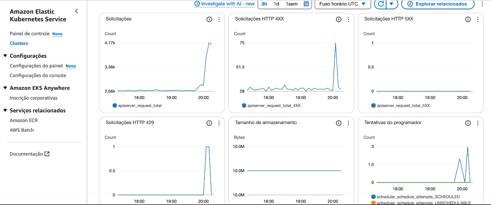
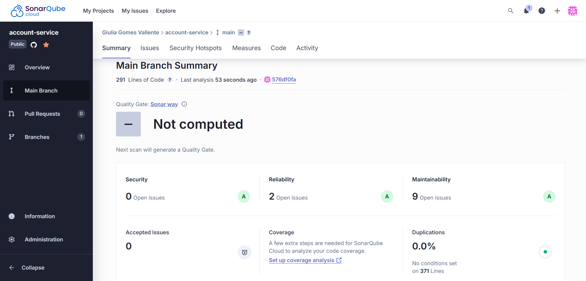
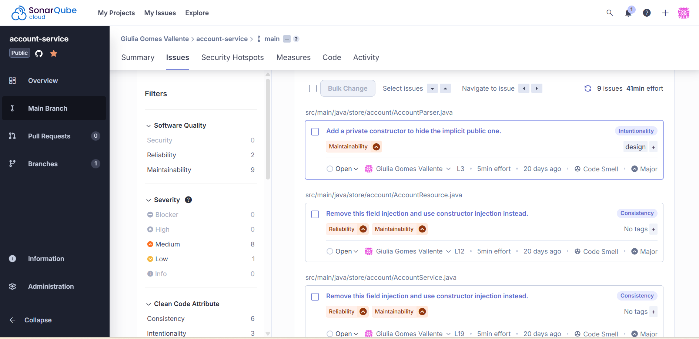

# BottleNecks

## Observabilidade no EKS com AWS CloudWatch

Para garantir a observabilidade e o monitoramento da nossa aplicação executada no Amazon EKS, utilizamos o serviço AWS CloudWatch, que é a ferramenta nativa da AWS para coleta de métricas, logs e eventos.

Realizamos toda a configuração de integração entre o EKS e o CloudWatch, o que nos permitiu: • Monitorar o desempenho dos pods e containers em tempo real; 

- Visualizar métricas como uso de CPU, memória e status dos serviços; 
- Configurar alertas automáticos para falhas ou comportamentos fora do esperado; 
- Analisar logs centralizados para facilitar a identificação e resolução de problemas.

Com isso, conseguimos ter visibilidade completa do ambiente e maior segurança na operação da nossa aplicação em produção.

## Análise de Vulnerabilidades com SonarQube

Para reforçar a segurança e a qualidade do nosso código, integrarmos nosso repositório ao SonarQube, uma ferramenta amplamente utilizada para análise estática de código. Com isso, conseguimos realizar vulnerability scanning e identificar problemas de segurança, bugs e más práticas logo nas primeiras etapas do desenvolvimento.

Os principais benefícios dessa integração foram: 

- Detecção automática de vulnerabilidades e códigos inseguros; 
- Análise contínua a cada push no repositório, integrando com nosso fluxo de CI/CD; 
- Relatórios claros e detalhados, com sugestões de correção; 
- Monitoramento de cobertura de testes, duplicações, complexidade e padrões de código.

Essa prática garantiu maior confiabilidade e segurança ao nosso software, além de facilitar a manutenção e evolução do sistema ao longo do tempo.

